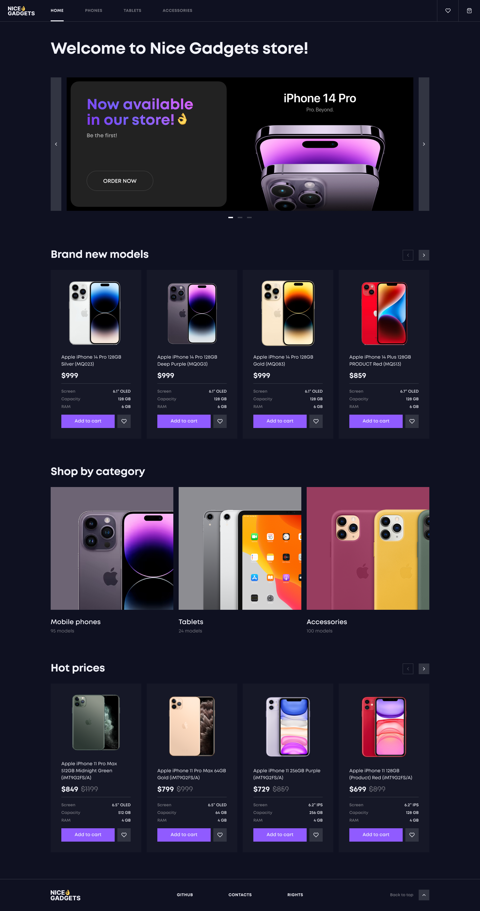
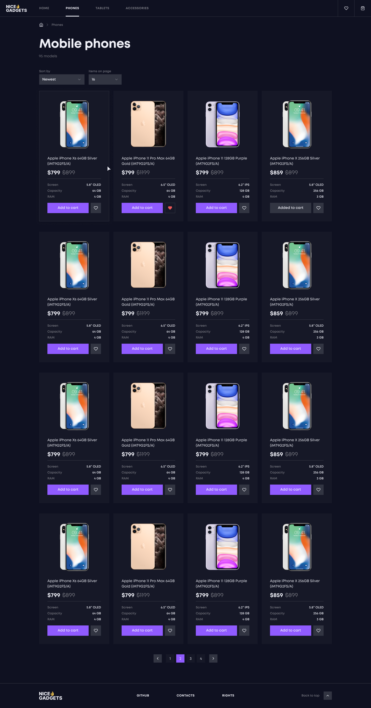
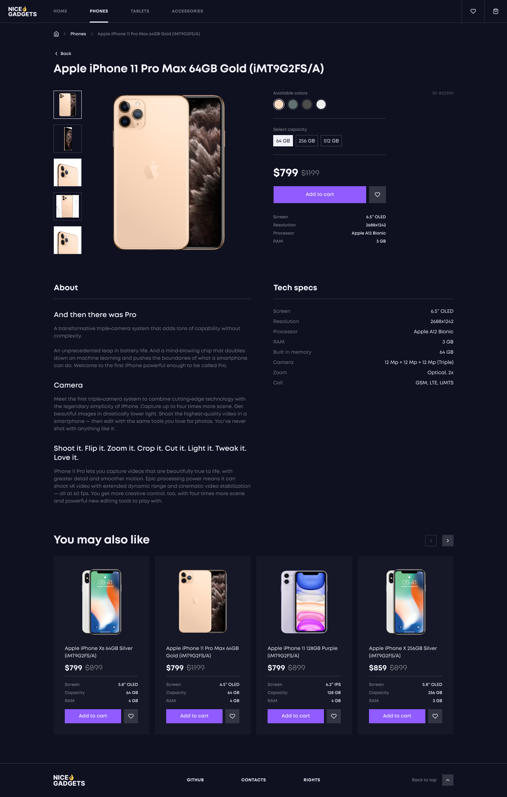
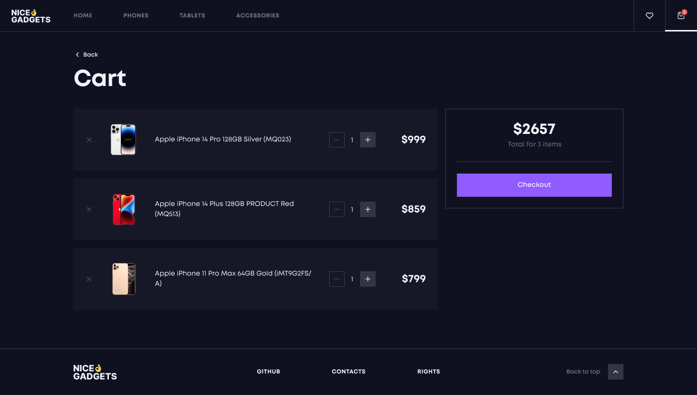

<h1 align="center">
  
</h1>

Welcome to the Nice Gadgets!  Visit our  website and find the perfect device for you!

  

## Why Nice Gadgets?

- **Wide selection**: You will find everything you need from us, from new iPhones to the latest accessories.
- **Best prices**: We offer competitive prices on all our products.
- **Original products** : We sell only original Apple products, so you can be sure of their quality and reliability.
- **Qualified staff** : Our consultants will help you choose the best product for your needs.
- **Fast delivery** : We offer fast delivery throughout Ukraine.

## Under the hood
- **React**: powerful open-source front-end JavaScript library for building user interfaces based on components.
- **Redux**: for managing and centralizing application state.
- **i18n**: for internazionalization of the website.
- **Framer motion**: for animation.
- **Swiper**: for all sliders on the 
- **SCSS Module**: SCSS tool that bridges clear styled code.
- **Adaptive design**: user's interface adapts to different screen sizes.
- **Semantic HTML**: using HTML elements to structure content based on each element's meaning.

## Screenshots

## Demo
This project is deployed on GH-pages . Check it out:
[**Nice Gadgets**](https://fs-mar24-codecrafters.github.io/react_phone-catalog/#/)
